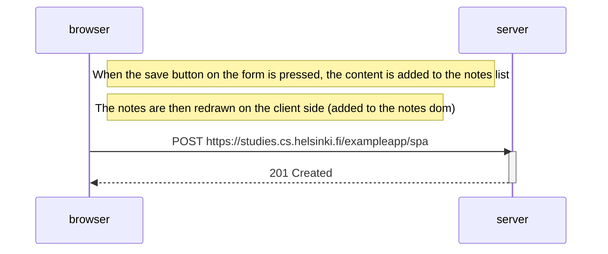

```mermaid
sequenceDiagram
    participant browser
    participant server

    Note right of browser: When the save button on the form is pressed, the content is added to the notes list 
    Note right of browser: The notes are then redrawn on the client side (added to the notes dom)
    
    browser->>server: POST https://studies.cs.helsinki.fi/exampleapp/spa
    activate server
    server-->>browser: 201 Created
    deactivate server   
    
```