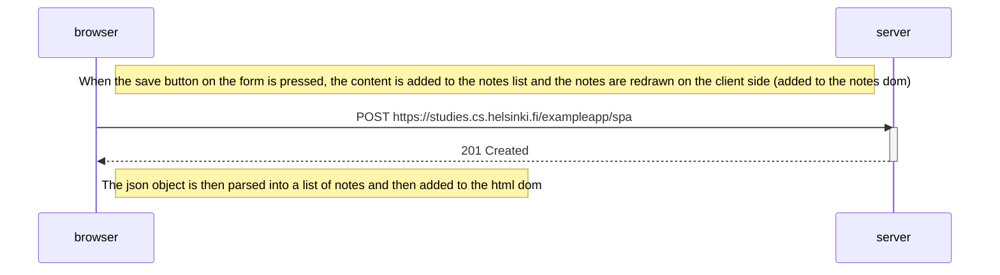

```mermaid
sequenceDiagram
    participant browser
    participant server

    Note right of browser: When the save button on the form is pressed, the content is added to the notes list and the notes are redrawn on the client side (added to the notes dom)

    browser->>server: POST https://studies.cs.helsinki.fi/exampleapp/spa
    activate server
    server-->>browser: 201 Created
    deactivate server

    Note right of browser: The json object is then parsed into a list of notes and then added to the html dom 
    
```